[References](https://blog.harmj0y.net/activedirectory/a-pentesters-guide-to-group-scoping/)

- Active Directory groups can have one of two types: distribution groups and security groups. "Distribution groups" are used for email distribution lists and cannot be used to control access to resources, so we don’t really care about them for our purposes. Most groups are “security groups” which CAN be used to control access and added into discretionary access control lists (DACLs). Whether or not a group is a security or distribution group is stored as a bit in its groupType property, detailed after the graphic below. 
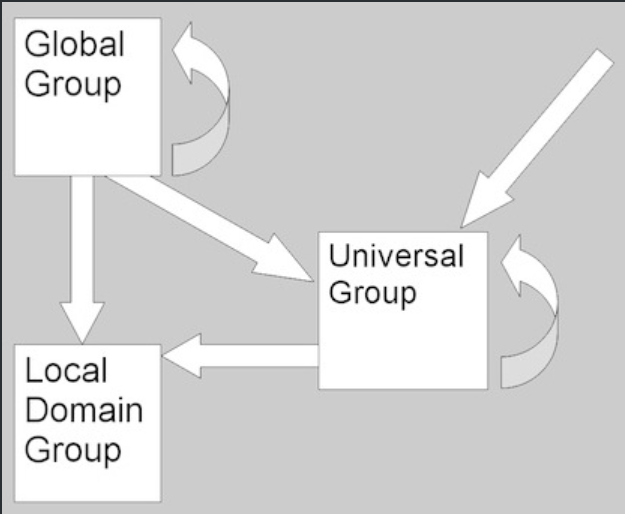

    + Global groups can be nested within Domain Local groups, Universal groups and within other Global groups in the same domain.
    + Universal groups can be nested within Domain Local groups and within other Universal groups in any domain.
    + A Domain Local group cannot be nested within a Global or a Universal group.

# PowerView usage
- search for all universal groups in current domain
```bash
Get-DomainGroup -Properties samaccountname.grouptype -GroupScope Universal
```
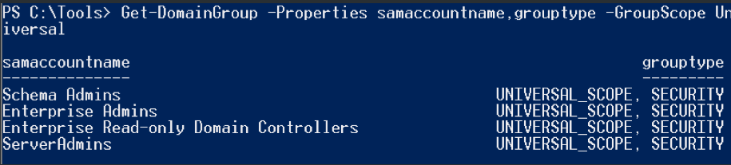
- search for all non-domain local groups in the current domain
```bash
Get-DomainGroup -Properties samaccountname.grouptype -GroupScope NotDomainLocal
```
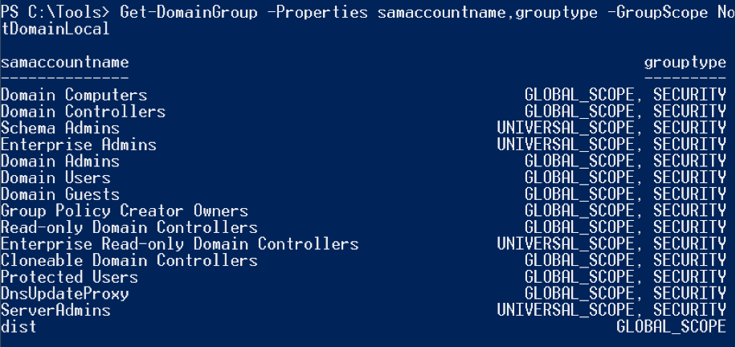
- Parse groupType properties of found group into human-readable enums
```bash
Get-DomainGroup ServerAdmins
```
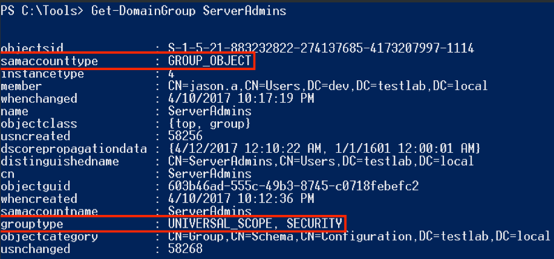

# Security Group Scoping
## Domain Local
- These are the easiest to explain- these are groups that are local to the current domain. That is, domain local groups are intended to help manage access to resources within a single domain. The fact that domain local groups can’t be added to global groups is an intended design effect: (domain local) groups that grant access to specific resources can not be added to organizational groups (i.e. global groups), which can prevent some accidental group nestings that may lead to unintended access later on.
- Can be nested in: only other domain local groups, from the same domain
- Can contain: global groups, universal groups, and foreign trust members
- Can be assigned permissions in: the same domain
- Memberships replicated in the global catalog: no
- Best Use:
    + Grant permissions to resources (e.g., shared folders or printers) located within the same domain.
    + Ideal for defining and managing access control lists (ACLs) for domain-based resources.
- Example:
    + Suppose you have a shared folder called FinanceReports on a file server within the Corp.local domain.
    + You can create a Domain Local Group named Finance_ReadOnly and grant it Read permissions on the folder.
    + Add the necessary Global Groups (like FinanceDepartment_Global from Corp.local or a trusted domain) to Finance_ReadOnly.
    + Users automatically inherit the permissions through their membership in the Global Group
- Advantages:
    + Simplifies resource management: You assign permissions once to the Domain Local Group rather than to individual accounts.
    + Flexibility: Can accommodate users or groups from multiple domains.
- Limitations:
    + Limited scope: Permissions are valid only in the domain where the Domain Local Group resides.
***Note: if you want a group that can grant access only to resources in the same domain, but can contain any other group scope (including users across an external trust) use a domain local scope.***

## Global
- Global groups are probably the trickiest of the three scopes to understand. They are usually used as an organizational structure for users who share comparable network access requirements. Global groups also can not be nested across domains, meaning a global group from one domain can’t be nested in a group in another domain. Also, users/computers from one domain can’t be nested in a global group in another domain, which is why users from one domain aren’t eligible for a membership in “Domain Admins” in a foreign domain (due to its global scope). Because global groups are not replicated in the global catalog (terrible naming conflict, I know) you can modify the membership of global groups without causing replication traffic to other domains in the forest.
- Can be nested in: universal and domain local groups
- Can contain: only global groups, from the same domain
- Can be assigned permissions in: any domain
- Memberships replicated in the global catalog: no
- Best use:
    + Used to group users or objects with similar roles or responsibilities (e.g., "HR_Employees_Global" or "IT_Staff_Global").
    + Assign permissions across multiple domains without requiring direct membership changes outside its own domain.
- Usage Example
    + Scenario:
        You have users in the Corp.local domain who require access to an HR application hosted in a different domain (HQ.local).
    + Solution:
        Create a Global Group in Corp.local named HR_Users_Global.
        Add relevant users from the Corp.local domain to this group.
        Add the HR_Users_Global group to a Domain Local Group (HR_App_Access) in the HQ.local domain that has permissions to access the application.
- Advantages: 
    + Efficient Management: Allows administrators to group users based on job function or location, making permissions management easier.
    + Portability: Ideal for assigning permissions in other domains without directly managing users there.
    + Supports Hierarchical Grouping: Can nest Global Groups for more streamlined administration.
- Limitations:
    + Membership is restricted to objects from the same domain.
    + If your environment spans multiple domains and forests, Universal Groups might be a better option for cross-domain membership.
- Best Practices:
    + Follow the AGDLP or AGUDLP model for permission management:
        Accounts → Global Groups → Domain Local Groups → Permissions (or Universal Groups → DLP).
    + This structure ensures scalability and simplifies cross-domain permissions management.
***Note: if you want a group that can be used in any domain in a forest or trusting domain, but can only contain users from that group’s domain, use a global scope.***

## Universal
- If you need a group that contains members from one or more domains within the same forest, and can be granted access to any resource in that forest, you need a universal scope. For nested group membership, all groups can be members of the same group type (for global this only applies to other global groups in the same domain). For universal groups specifically, any changes in the membership will propagate to the global catalog.
- Can be nested in: domain local groups and other universal groups
- Can contain: global groups and other universal groups
- Can be assigned permissions in: any domain or forest
- Memberships replicated in the global catalog: yes
- Replication Behavior:
    + Membership changes to Universal Groups are replicated globally to all Global Catalog (GC) servers within the forest.
    + This means changes can cause increased replication traffic, so they should be used judiciously.
- Usage Example
    + Scenario:
        A company has two domains: Corp.local and HQ.local.
        Employees from both domains need access to a shared resource hosted in HQ.local.
    + Solution:
        Create a Universal Group called SharedResource_Users_Universal.
        Add users or Global Groups from both Corp.local and HQ.local to this Universal Group.
        Assign the Universal Group permissions to access the shared resource.
- Advantages:
    + Cross-Domain Membership: Allows members from any domain in the forest, making it ideal for global or forest-wide groups.
    + Simplified Permissions Management: Reduces the need for complex group nesting when dealing with multi-domain access.
    + Replication Efficiency for Permissions: Permissions assigned to Universal Groups do not require additional configuration in each domain.
- Limitations:
    + Membership changes trigger forest-wide replication, which can increase network traffic if used excessively or in large environments.
    + Requires the domain to be in native mode (Windows 2000 or later with no legacy domain controllers) for security Universal Groups.
- Best Practices:
    + Use Universal Groups primarily for:
        Granting access to resources that span multiple domains.
        Serving as intermediary groups in the AGUDLP model (Accounts → Global Groups → Universal Groups → Domain Local Groups → Permissions).
    + Avoid excessive use to minimize replication traffic, especially in environments with many Global Catalog servers.
***Note: if you want a group that can be given access to anything in the forest, and can contain any user/group/computer in the forest, use a universal scope.***
## Scenario: 
### Company with two domains
- Company: Contoso Ltd.
- Domains:
    + Sales.Contoso.com (Sales department)
    + HR.Contoso.com (HR department)
- Shared Resource: A file server in the Sales.Contoso.com domain with a folder called Reports that employees from both domains need to access:
    + Sales employees should have Read/Write access.
    + HR employees should have Read-Only access.
### Group Types in Action
#### 1. Global Groups (Organize Users by Role or Department)
- Purpose: Groups users within the same domain by role or department.
- Example Groups:
    + In Sales.Contoso.com:
        Sales_ReadWrite_Global: Includes all Sales employees who need Read/Write access.
    + In HR.Contoso.com:
        HR_ReadOnly_Global: Includes all HR employees who need Read-Only access.
- Why?
    + Global Groups are ideal for organizing domain-specific users or computers into logical groups based on roles.
#### 2. Universal Groups (Combine Cross-Domain Global Groups)
- Purpose: Combine Global Groups from different domains for forest-wide access.
- Example Groups:
    + Reports_ReadWrite_Universal: Includes Sales_ReadWrite_Global from Sales.Contoso.com.
    + Reports_ReadOnly_Universal: Includes HR_ReadOnly_Global from HR.Contoso.com.
- Why?
    + Universal Groups allow you to consolidate users or groups from multiple domains, making them ideal for cross-domain permissions.
#### 3. Domain Local Groups (Grant Permissions to Resources)
- Purpose: Assign permissions to resources in the same domain.
- Example Groups:
    + Reports_ReadWrite_Local: Grants Modify permissions on the Reports folder.
    + Reports_ReadOnly_Local: Grants Read permissions on the Reports folder.
- Members:
    + Reports_ReadWrite_Local includes Reports_ReadWrite_Universal.
    + Reports_ReadOnly_Local includes Reports_ReadOnly_Universal.
- Why?
    + Domain Local Groups are designed to control access to resources in their own domain.

<table border="1" style="border-collapse: collapse; width: 100%;">
    <thead>
        <tr>
            <th>Group Type</th>
            <th>Scope</th>
            <th>Example Use Case</th>
            <th>Membership</th>
        </tr>
    </thead>
    <tbody>
        <tr>
            <td><strong>Global Group</strong></td>
            <td>Domain-specific</td>
            <td>Organize Sales and HR employees within their respective domains.</td>
            <td>Users or other Global Groups from the same domain.</td>
        </tr>
        <tr>
            <td><strong>Universal Group</strong></td>
            <td>Forest-wide</td>
            <td>Combine Sales and HR groups for access to the <code>Reports</code> folder across domains.</td>
            <td>Global Groups from multiple domains.</td>
        </tr>
        <tr>
            <td><strong>Domain Local Group</strong></td>
            <td>Resource-specific within a domain</td>
            <td>Grant <code>Read/Write</code> and <code>Read-Only</code> permissions to the <code>Reports</code> folder hosted in <code>Sales.Contoso.com</code>.</td>
            <td>Users, Global Groups, or Universal Groups from any domain.</td>
        </tr>
    </tbody>
</table>

# Global Catalog
- The global catalog is a partial copy of all objects in an Active Directory forest, meaning that some object properties (but not all) are contained within it. This data is replicated among all domain controllers marked as global catalogs for the forest. One point of the global catalog is to allow for object searching and deconfliction quickly without the need for referrals to other domains. The nice side effect from an offensive perspective is that we can quickly query information about all domains and objects in a forest with simple queries to our primary domain controller.
- The properties that are replicated are marked in the forest schema as the “partial attribute set”. You can easily enumerate these property names with PowerView:
```bash
Get-DomainObject -SearchBase "CN=Schema,CN=Configuration,DC=testlab,DC=local" -LDAPFilter "(isMemberOfPartialAttributeSet=TRUE)" | Select name
```
***Note:the initial global catalog is generated on the first domain controller created in the first domain in the forest. The first domain controller for each new child domain is also set as a global catalog by default, but others can be added.***
- Key Features of the Global Catalog
    + Contains Partial Attribute Set (PAS): The GC does not store all attributes of every object. Instead, it contains a subset of attributes (those marked as "global catalog attributes"). Common examples include user logon names, group memberships, and email addresses.
    + Forest-Wide Scope: The GC stores information from all domains in the forest. This allows users and applications to search across the forest without needing direct access to domain-specific domain controllers.
    + Read-Only Data: Information stored in the GC is read-only. Changes must be made on the original domain controller where the object resides.
- Functions of the Global Catalog
    + Facilitates Forest-Wide Searches:
        > Provides quick access to objects across all domains in the forest.
        > For example, when a user searches for another user by name in the address book, the GC helps locate the object, even if it resides in another domain.
    + Supports Universal Group Membership Resolution:
        > The GC helps determine a user’s Universal Group memberships during logon, which is essential for granting access to resources in multi-domain environments.
    + Speeds Up Logon and Authentication:
        > When a user logs on to a domain, the GC is queried to verify Universal Group memberships if the user is from a different domain.
    + Application Integration:
        > Applications like Microsoft Exchange depend on the GC to retrieve directory information across the forest, such as user email addresses.
- How the Global Catalog Works
    + Replication:
        > GC servers replicate data from all domains in the forest but only the attributes that are part of the PAS.
        > Replication ensures that every GC server contains up-to-date information.
    + Partial vs. Full Data:
        > Objects in the local domain: All attributes are available on the GC.
        > Objects from other domains: Only the PAS attributes are replicated.
- Benefits of Using the Global Catalog
    + Improved Query Performance:
        > Instead of querying every domain controller, users and applications query a single GC server for forest-wide data.
    + Simplifies Administration:
        > Universal Group memberships and resource access are easier to manage in multi-domain forests.
    + Scalability:
        > By adding more GC servers, you can distribute the load and improve fault tolerance.
- Considerations
    + Network Traffic:
        > Adding more GC servers increases replication traffic, as GC servers must stay synchronized across the forest.
    + Placement:
        > Place GC servers in locations with many users or applications requiring cross-domain lookups to reduce latency and improve performance.
    + Size and Resource Use:
        > GC servers require more storage and memory than regular domain controllers because they store data from all domains.
## Finding Global Catalogs
- Before you can interact with the global catalog it helps to know where all of them are. There are obviously options through tools like nslookup and dsquery, but we’ll use a bit of PowerShell again. .NET has this functionality nicely built in
```bash
$Forest = [System.DirectoryServices.ActiveDirectory.Forest]::GetCurrentForest()
$Forest.FindAllGlobalCatalogs()
```
- PowerView Get-ForestGlobalCatalog
```bash
Get-ForestGlobalCatalog
```
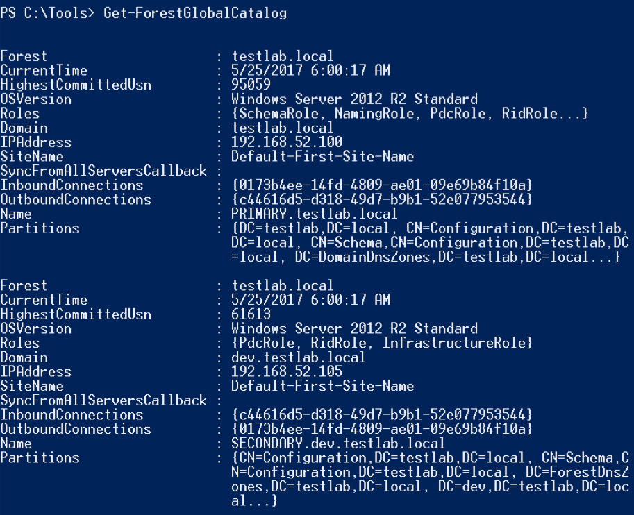
## Searching the GC
- To search a global catalog with PowerView, replace “LDAP://…” with “GC://” when specifying an LDAP search string for -SearchBase. In practice you can usually use “-SearchBase “GC://domain.com” which will map to the global catalog for that domain. This is usually my preference. For an operational example, here is how you could enumerate ALL computer DNS host names in the current forest by using the PRIMARY.testlab.local parent domain global catalog as shown above:
```bash
Get-DomainComputer -SearchBase "GC://PRIMARY.testlab.local" -Properties dnshostname
```
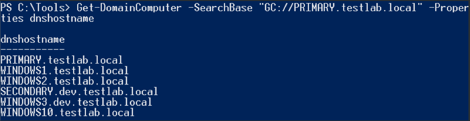
- Results are the same agaisnt another GC in another domain in same forest
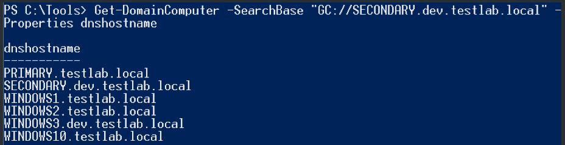

# Group Scopes and the Global Catalog
- Group scopes matter when it comes to global catalog replication. The group memberships of domain local groups and global groups are not replicated to the global catalog, although the group objects themselves are. Universal groups are replicated along with their full memberships. Stated in another way by Microsoft, “Groups with universal scope, and their members, are listed exclusively in the global catalog. Groups with global or domain local scope are also listed in the global catalog, but their members are not.”
- One nice side effect: we can easily enumerate the members of ANY universal group for ANY domain in a forest by just communicating with a domain controller in our same domain. This means that we only initiate traffic with a domain controller in our current domain. With PowerView we can enumerate all groups with memberships for a global catalog in testlab.local with:
```bash
Get-DomainGroup -SearchBase "GC://testlab.local" -Properties grouptype,name,member -LDAPFilter '(member=*)'
```
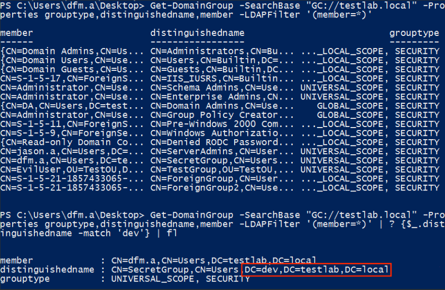
- These results demonstrate the differences in replication. Above there is only one group from dev.testlab.local that returned with membership results, due to its universal scope. Here are the complete group membership results through straight LDAP/non-global catalog querying. You can see the additional group results, as well as their global/domain local scopes:
```bash
Get-DomainGroup -LDAPFilter '(member=*)' -Domain dev.testlab.local -Properties distinguishedname,grouptype | fl
```
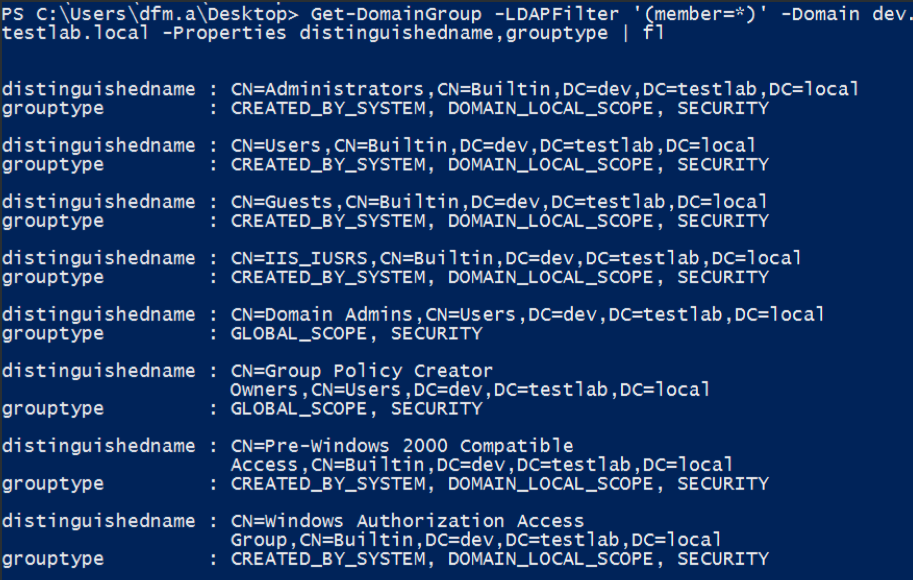

# Group Scoping and External Trusts
- Users that exist in external or forest trusts, external from the domain's current forest, can still be added to domain local groups in the specified domain. These users show up as new entries in CN=ForeignSecurityPrincipals,DC=domain,DC=com. Or, as Microsoft explains it, "When a trust is established between a domain in a forest and a domain outside of that forest, security principals from the external domain can access resources in the internal domain. Active Directory creates a foreign security principal object in the internal domain to represent each security principal from the trusted external domain. These foreign security principals can become members of domain local groups in the internal domain".
- Remember that "security principals" means either groups, users, or computers, i.e. anything with a security identifier. You can enumerate these members quickly by setting the SearchBase for a search to be "CN=ForeignSecurityPrincipals,DC=domain,DC=com".  For example:
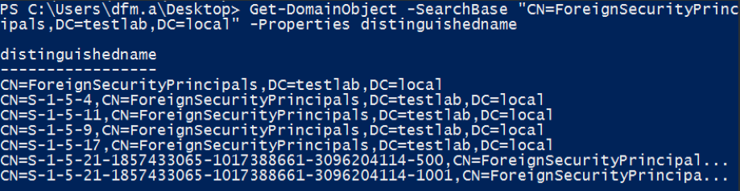
- You can see the two foreign domain SIDs at the bottom of those results. If any of these foreign users are members of groups in your target domain, the Get-DomainForeignGroupMember function should tease these out as well. But remember that the only way this is possible is if the group is a domain local scope:
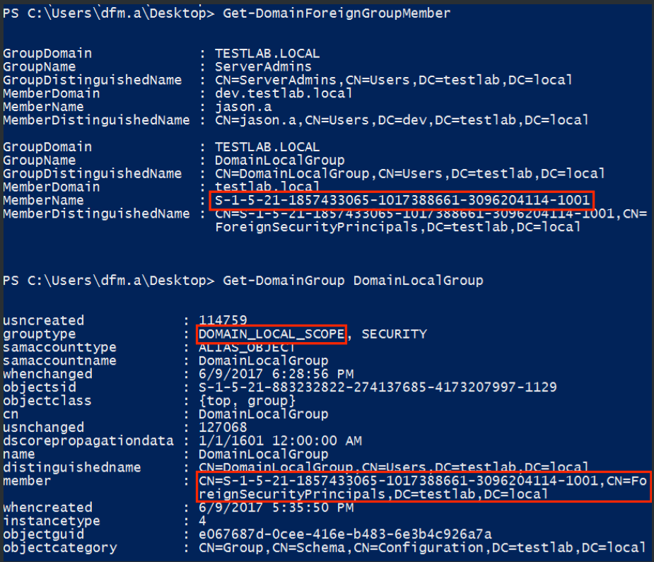

# Offensive Operations
- I previously covered using the global catalog for command and control in and Active Directory environment (something that inspired a BlackHat talk ;) but there are a few additional reasons that I can think of to use the global catalog offensively when dealing with a multi-domain forest. The first is if you get a plain samaccountname for a user/group/computer and want to know what domain the account resides in. This is what we do with the BloodHound ingestor, as the samaccountnames returned from a Get-NetSession result don’t contain domain names. In fact, this is one of the main reasons the global catalog was built, for object deconfliction:
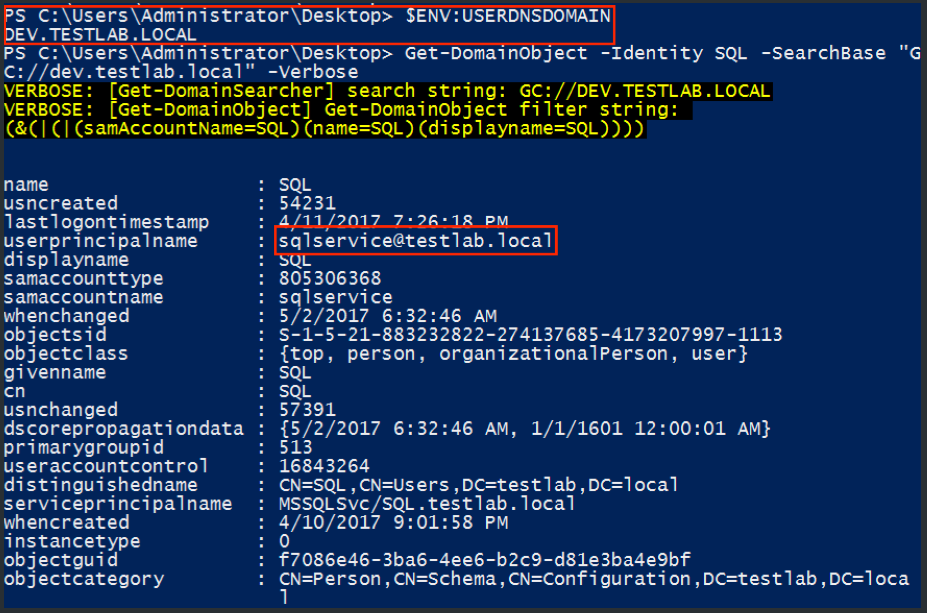
- Another option is to quickly enumerate all objects of a certain type throughout the forest, i.e. get all computer DNS names for the entire setup, as we saw in the “Searching the Global Catalog” section. So let’s go a step further and enumerate all Kerberoastable accounts in the entire forest, since the servicePrincipalName property is replicated
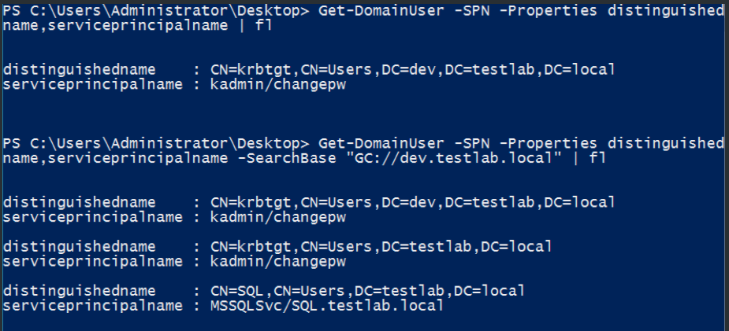
- This also applies to domain trusts! Trusts can be enumerated through LDAP with the ‘(objectClass=trustedDomain)’ filter, so with some recent mods for PowerView we can run the following to quickly enumerate all domains in the trust mesh:
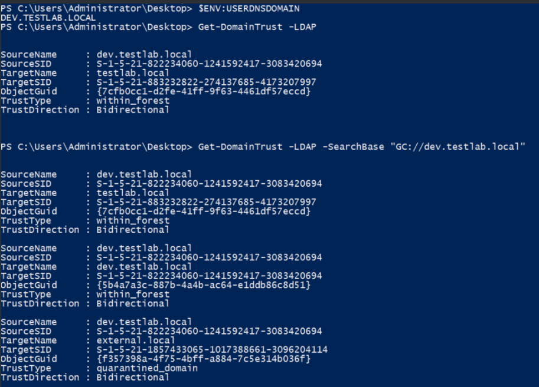