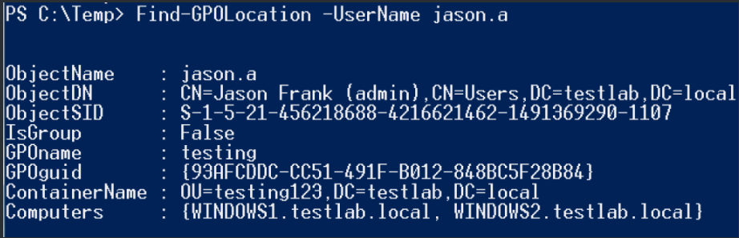

[References](https://blog.harmj0y.net/redteaming/local-group-enumeration/)
# Get-NetLocalGroup
-  Get-NetLocalGroup utilizes the Active Directory Service Interfaces [ADSI] WinNT provider to query the members of a local group (default of 'Administrators') from a remote machine. 
- We can pull not just group member names, but whether the member is a group or user, whether the account is disabled, the account’s last login time, the account SID, and more.
- With the SID we can also determine if the result is a local account/group or a domain account as well. And what’s really cool is that we can query all of this information as an unprivileged domain user context (though you do need a domain authenticated account).
```bash
Get-NetLocalGroup -ComputerName "name"
```

- This information is great for determining whether you can pass-the-hash to a remote machine. If the local account with a SID ending in -500 is enabled or a domain account is in the machine’s local administrators, you can still pass-the-hash with those credentials.
- List local groups and members on machine
```bash
Get-NetLocalGroup -ComputerName "name" -ListGroups
Get-NetLocalGroup -ComputerName "name" -GroupName "group_name"
```

- **Get-NetLocalGroup** accepts NetBIOS names, IPs, and fully qualified host names for targets. There’s also an **-API** flag, which uses the **NetLocalGroupGetMembers API** call instead of the WinNT service provider. This returns more limited information, but is significantly faster.
# Local Groups, Server Targeting, and Domain Trusts
- Perform local admin access enumeration on all computers listed in Active Directory and output everything to a nicely sortable .csv. But be warned: this can be very slow for large environments, and it is definitely not stealthy, as you are touching every machine as quickly as your system will allow.
```bash
Invoke-EnumerateLocalAdmin | ft -autosize [-OutFile admin.csv]
```

# Tracking Local Administrators by Group Policy Objects
- Get-NetGPOGroup is where everything starts. It will enumerate all current GPOs with Get-NetGPO and will parse any GptTmpl.inf files (located at “$GPOPath\MACHINE\Microsoft\Windows NT\SecEdit\GptTmpl.inf”) and any Groups.xml files (located at “$GPOPath\MACHINE\Preferences\Groups\Groups.xml”). GptTmpl.inf is used by Group Policy to set ‘Restricted Groups’, i.e. what users are members of specific local groups on machines where the policy is applied. Groups.xml is used by Group Policy Preferences to perform similar task.

- You can see above that Members contains the security identifiers of users/groups we’re interested in, and the MemberOf field specifies their local group membership (in this case ‘Administrators’, with well known SIDs documented [here](https://learn.microsoft.com/en-us/windows-server/identity/ad-ds/manage/understand-security-identifiers))
- **Find-GPOLocation** takes a specified -UserName <USER> or -GroupName <GROUP> and returning the set of computers they can access. If a user or group name is not specified, all relationships for the domain will be returned. Also, a different -LocalGroup can be specified (default of 'Administrators').

- There’s also a functional inverse, **Find-GPOComputerAdmin**, that will return what objects have membership for a specified -LocalGroup on a target system. The -Recurse flag will resolve the membership of any results that are a group themselves.

-  like **Get-NetLocalGroup**, these functions don't need elevated access to query this information. However, **Find-GPOComputerAdmin** will only return domain results, i.e. local user accounts will not be returned.